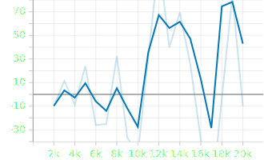

# Applying RL to Elevator Movement
## Project Summary
<!-- Around 200 Words -->
<!-- Cover (1) What problem you are solving, (2) Who will use this RL module and be happy with the learning, and (3) a brief description of the results -->
Traditionally, elevator movement follows a predictable pattern in which elevators will move up then move down, however the system can be frustrating for many people when elevators end up accumulating many people on a floor causing frustration. We propose a reinforcement learning approach for making elevators more efficient by allowing elevators to diverge from this fixed pattern.

Elevator designers may be able to incorporate this algorithm into designing efficient elevators that can effectively transport people. For many large buildings where elevator efficiency is a problem, a reinforcement learning algorithm that improves the efficiency of the elevators would save companies a lot of money in improved worker hours and improved productivity. An elevator that is able to reach users quickly would also decrease frustration and stress, meaning that people using these elevators as a service in a business would also experience improved moods and impressions.

However, the algorithm we have tested under the restrictions we list below did not seem to learn the problem. We believe this to be caused by the partially observable nature of the problem, resulting in a non-Markovian environment that is difficult to learn.

## State Space
<!-- See the Cart Pole Env example https://gymnasium.farama.org/environments/classic_control/cart_pole/ -->
We try to reveal only as much information as an elevator would realisitically have or be able to obtain under normal circumstances. This means that we have the elevator position, the number of people in the elevator, which floors are selected by people inside the elevator, and which floors have people waiting for the elevator. The state space is encoded with a dictionary:

Given an n-floor elevator, where n is adjustable:

| Key             | Observation                    | Min               | Max               |
|-----------------|--------------------------------|-------------------|-------------------|
| position        | Position of Elevator           | 0                 | n - 1             |
| num_people      | Number of People in Elevator   | 0                 | 2000              |
| floors_selected | Floors Selected Inside         | List of 0s size n | List of 1s size n |
| floors_waiting  | Floors that People are Waiting | List of 0s size n | List of 1s size n |

## Action Space
<!-- See the Cart Pole Env example https://gymnasium.farama.org/environments/classic_control/cart_pole/ -->
The RL Agent decides whether to move the elevator to a different floor or to load/unload people. The action is taken as a value in {0, 1, 2} corresponding to the following actions:

- 0: Move the elevator down by one floor
- 1: Leave the elevator in place, but load and unload everyone for which the current floor is their destination / current waiting location.
- 2: Move the elevator up by one floor

## Rewards
<!-- See the Cart Pole Env example https://gymnasium.farama.org/environments/classic_control/cart_pole/ -->
At every time step, the agent receives a reward of -1 for every person waiting outside the elevator and -0.5 for every person waiting inside the elevator. This is calculated before new people arrive at every floor after the action but after people get on and off the elevator.

## RL Algorithm 
For this problem, we will be applying a DQN algorithm to test this environment. DQN is an off-policy neural-network based method which is strong inspired by Q-learning, taking in a continuous state space and a discrete action space. [1]

We will be using Ray RLlib's DQN implementation for this problem. In this problem, although we have a discrete state representation, RLlib only offers DQN as a Q-learning solution. We utilized the default parameters for RLlib's DQN algorithm.

## Starting State [if applicable]
<!-- See the Cart Pole Env example https://gymnasium.farama.org/environments/classic_control/cart_pole/ -->
This is a continuing task.

## Episode End [if applicable]
<!-- See the Cart Pole Env example https://gymnasium.farama.org/environments/classic_control/cart_pole/ -->
This is a continuing task. For speed of training, the episode is truncated after 200 experiences.

## Results
For all results below, the DQN agent was tested on an elevator system with eight floors. The DQN agent was not able to learn the task at all, with rewards per episode decreasing.

### Mean Return per Episode

Looking at the mean return per episode, it becomes apparent that the agent performs worse over time. Although the rewards increase for the first few thousand episodes, the average return begins to decrease after that. After 10 thousand episodes, the model performs worse than when it started.

To analyze the source of this error, we can try to analyze some other plots.

### Mean Q Over Per Episode

As the episodes progress, we see the Q-values continue to decrease. This could indicate that the model is still learning, as the Q-values have not stabilized at this point. However, this could also be caused by POMDP interfering with the Q-values of each state.

### Mean TD Error Per Episode

We can see as the episodes progress that the TD error continues to increase over time. This is an indication that the POMDP is crippling the learning process as the network cannot assign a proper Q-value to a state. This variance is enough to explain why the agent failed to learn on this problem.

To alleviate the issue with the agent not being able to learn, next steps could be fully revealing the number of people waiting at each floor and the number of people who are inside the elevator who want to go to a certain floor. As the reward from this point becomes fully deterministic, this should stabilize the learning. However, for this to be practical in a real world scenario, elevator manufacturers must also somehow gather data of how many people are waiting for each floor for example, and this could range from being impractical to being impossible.

[1] V. Mnih et al., ‘Playing Atari with Deep Reinforcement Learning’, arXiv [cs.LG]. 2013.